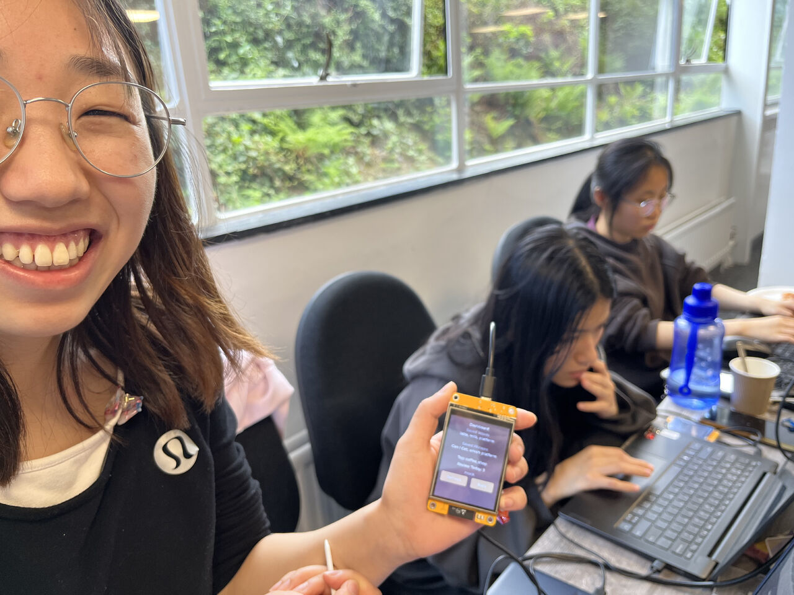
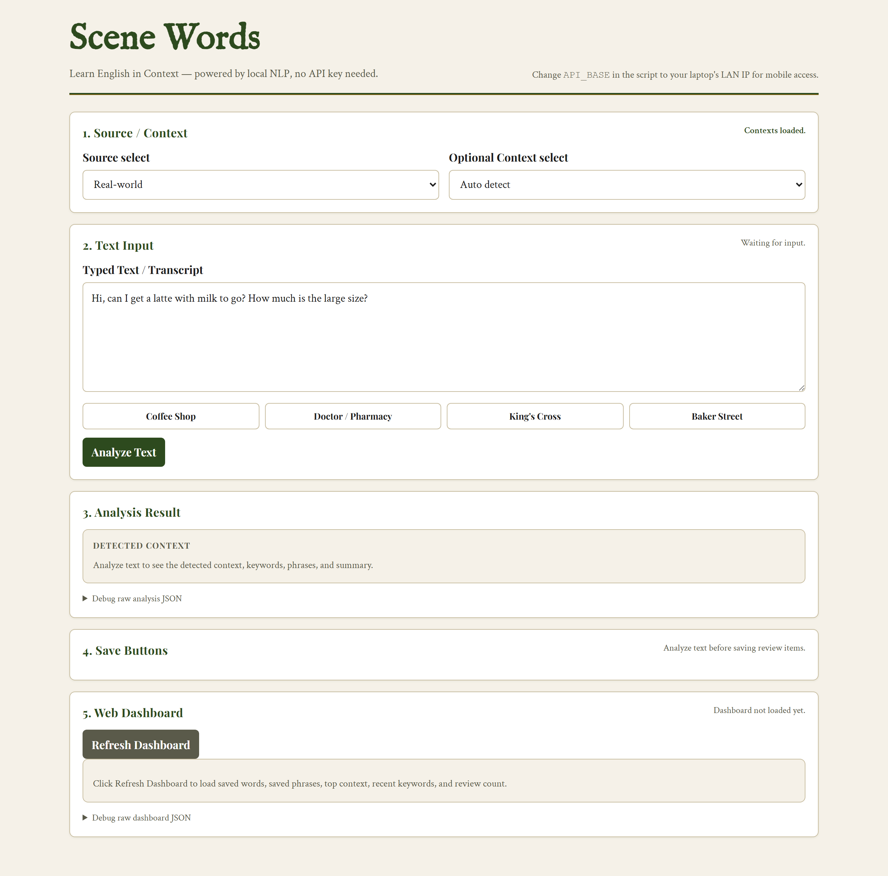
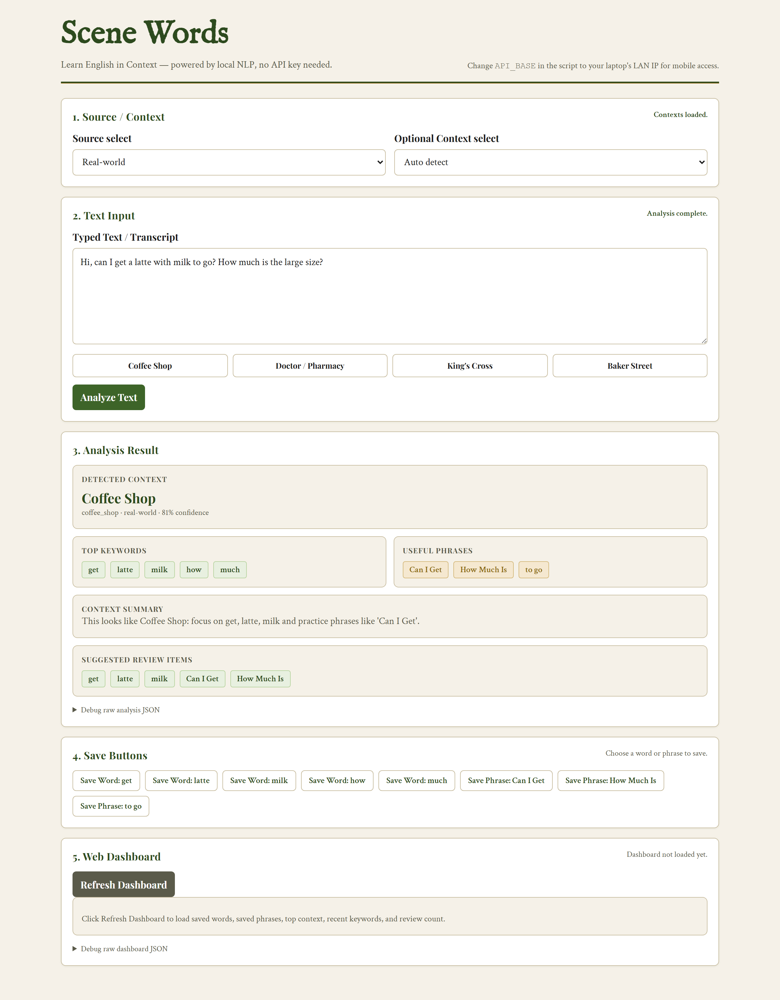
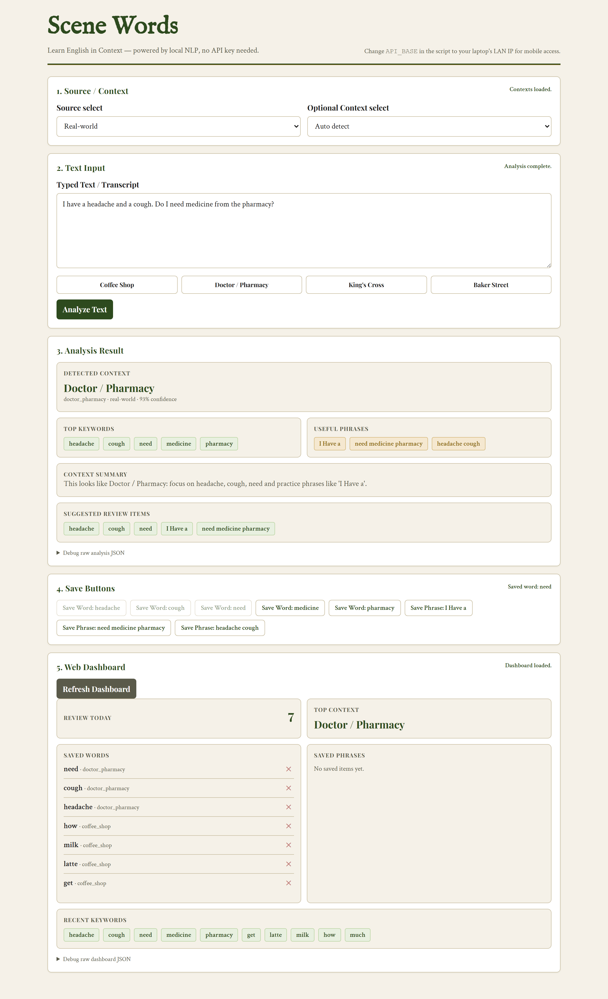

# Scene Words

> **Context-based English learning, fully offline.** A hackathon MVP that runs across a web browser, a FastAPI backend, and an ESP32 "Cheap Yellow Display" — no LLM API key, no cloud, no network required.



*Live demo at the Aberystwyth hackathon — the handheld CYD board renders the same Dashboard that the web app does, both backed by the local FastAPI service.*

## What it does

Type or paste an English sentence — for example *"Hi, can I get a latte with milk to go? How much is the large size?"* — and a rule-based NLP pipeline:

1. **Detects the scene context** (Coffee Shop / Doctor / King's Cross / Baker Street) with a confidence score
2. **Extracts useful keywords and phrases** from the text
3. **Generates a one-line summary** of what's happening in the scene
4. **Saves anything you tap** into a SQLite-backed review library
5. **Renders the dashboard** on both the browser and the embedded CYD touch screen

Everything runs on local Python standard library + SQLite. No LLM, no API key, no internet.

## Demo

### 1. Input — pick a source, type a sentence, or use a demo button


### 2. Analysis — context detected, keywords + phrases + summary in one response


### 3. Dashboard — saved items aggregated, each tagged by source context


## Tech stack

| Layer | Tech |
| --- | --- |
| **Backend / NLP** | Python 3, FastAPI, Uvicorn, Pydantic v2, SQLite |
| **Web** | Vanilla HTML / CSS / JavaScript (no framework, no build step) |
| **Embedded** | MicroPython on ESP32 CYD, LVGL 9, ILI9341 display, XPT2046 touch |

## Architecture

Three independent "lines" connected only through HTTP + JSON:

```
       Web Input  /  CYD touch
              │
              ▼
   POST /analyze_text  ──►  FastAPI (backend/main.py)
              │
              ▼
   nlp_engine.analyze_text()
   tokenize → clean → keyword extraction
            → context classification
            → phrase extraction → summary
              │
              ▼
   SQLite (scenelingo.db)
              │
              ▼
   GET /dashboard  ──►  Web Dashboard  /  CYD Dashboard
```

API surface:

```
POST /analyze_text       analyze a text and persist the result
GET  /contexts           list real-world and story contexts
GET  /context/{id}       one context's seed keywords + phrases
POST /save_item          save a word or phrase to the review list
DELETE /saved_item/{id}  remove a review item
GET  /dashboard          aggregated review state (top context, recent keywords, saved items)
```

## Run locally

```powershell
python -m venv .venv
.\.venv\Scripts\Activate.ps1
pip install -r requirements.txt
uvicorn backend.main:app --reload
```

Backend serves at `http://localhost:8000`. Then open `web/index.html` directly in a browser, or flash `embedded/scenelingo_dashboard.py` onto a CYD board.

## Project layout

```
backend/        FastAPI routes, rule-based NLP engine, SQLite storage
web/            single-page browser input + dashboard
embedded/       MicroPython LVGL UI for the ESP32 CYD
docs/           product walkthrough, integration log, per-line task records
img/            screenshots and reference photos
```

## More docs

- [`docs/Scene_Words_产品介绍.md`](docs/Scene_Words_产品介绍.md) — full product walkthrough (Chinese)
- [`docs/INTEGRATION_RECORD.md`](docs/INTEGRATION_RECORD.md) — three-line integration log
- [`docs/LINE_A`](docs/LINE_A) / [`docs/LINE_B`](docs/LINE_B) / [`docs/LINE_C`](docs/LINE_C) — per-line task records

## Team

Built at the Aberystwyth University hackathon by:

- [@Geist-L](https://github.com/Geist-L) — Line A (FastAPI backend, rule-based NLP engine, SQLite layer)
- [@ava-wei666](https://github.com/ava-wei666) — Line C (CYD embedded UI in MicroPython + LVGL), Web–CYD integration
- Ruotong Huang — Line B (web input page, web dashboard)
